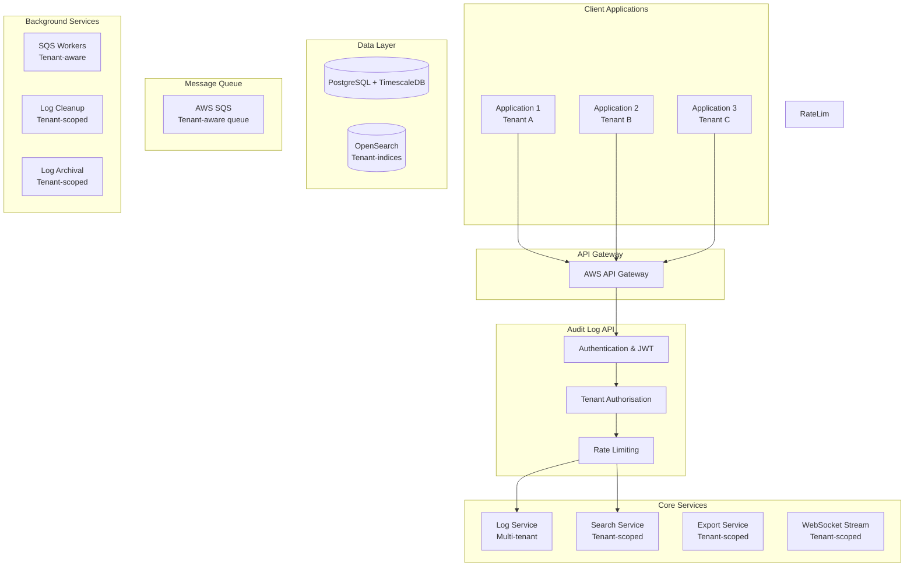

# Resola code challenge - Audit Log API

This project implements a multi-tenant Audit Log API using FastAPI. It demonstrates scalable logging, background processing, and secure tenant-based access control. It is built for extensibility, API gateway integration, and cloud readiness.

## ⚙️ Tech Stack
- **Framework:** FastAPI
- **API Gateway:** AWS API Gateway
- **Database:** PostgreSQL + TimeScaleDB
- **Message Queue:** AWS SQS
- **Search:** OpenSearch
- **Authentication:** JWT Token Authentication

## ✅ Features
- Secure tenant-based audit log creation and retrieval
- Background task queueing using SQS
- OpenSearch indexing for tenant-specific full-text search
- WebSocket real-time log streaming
- Log export (CSV), stats aggregation, and bulk operations
- Tenant management for admin users

## Documentation
- View the interactive documentation: [localhost:8000/docs](http://localhost:8000/docs)
- OPENAPI spec (YAML): [openapi.yaml](./openapi.yaml)

## API Endpoints
```commandline
POST   /api/v1/logs                   # Create log entry (with tenant ID)
GET    /api/v1/logs                   # Search/filter logs (tenant-scoped)
GET    /api/v1/logs/{id}              # Get specific log entry (tenant-scoped)
GET    /api/v1/logs/export            # Export logs (tenant-scoped)
GET    /api/v1/logs/stats             # Get log statistics (tenant-scoped)
POST   /api/v1/logs/bulk              # Bulk log creation (with tenant ID)
DELETE /api/v1/logs/cleanup           # Cleanup old logs (tenant-scoped)
WS     /api/v1/logs/stream            # Real-time log streaming (tenant-scoped)

GET    /api/v1/tenants                # List accessible tenants (admin only)
POST   /api/v1/tenants                # Create new tenant (admin only)
```

## Architecture Diagram

### System Architecture (WIP)


## Postman Collection 

You can use the Postman collection below to explore and test the API:
- Download [Postman collection](postman/postman_collection.json)

To import:
1. Open Postman
2. Click `Import`
3. Select the downloaded `.json` file

## Project Structure
```
├── .aws/                   # Amazon AWS credentials (access key, secret access key)
├── postman/                # Postman collection (.json)
├── routers/                # Sub-routine files
│   ├── audit_logs.py       # API endpoints for audit_logs class 
│   └── tenants.py          # API endpoints for tenants class
├── tests/                  # Test scripts
│   ├── test_audit_logs.py
│   ├── test_main.py
│   └── test_tenants.py
├── venv/                   # Virtual environment setup
├── .gitignore              # Git ignore rules
├── auth.py                 # Authentication configuration
├── db.py                   # Database connection
├── openapi.yaml            # API documentation
├── schemas.py              # Class declaration
├── utils.py                # Utility functions
└── README.md               # Project documentation
```

## Local Development Setup (WIP)

### Install dependencies
```bash
pip install
```

### Initiate virtual environment
```bash
./venv/Scripts/activate
```

### Run local development server
```bash
uvicorn main:app --reload
```

## Learn More

- [FastAPI Documentation](https://fastapi.tiangolo.com/)
- [Postman Documentation](https://www.postman.com/product/what-is-postman/)
- [PyJWT](https://pyjwt.readthedocs.io/en/stable/index.html)