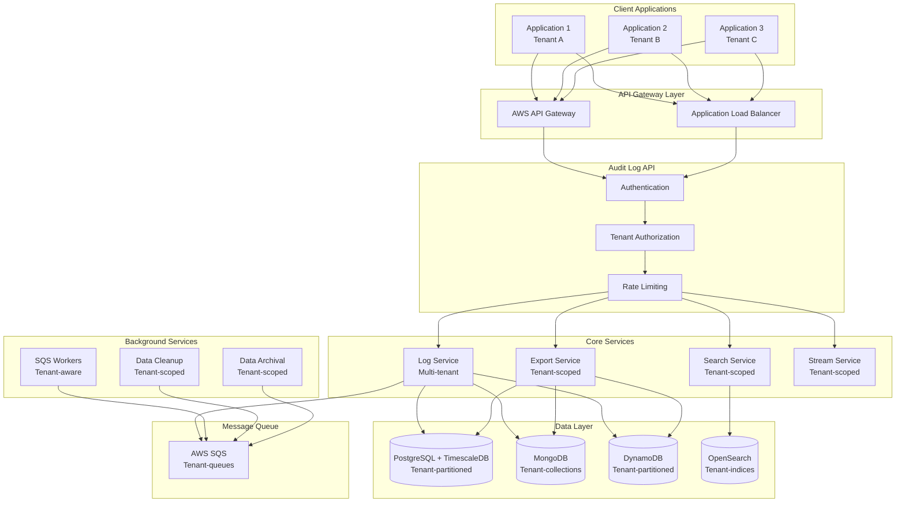
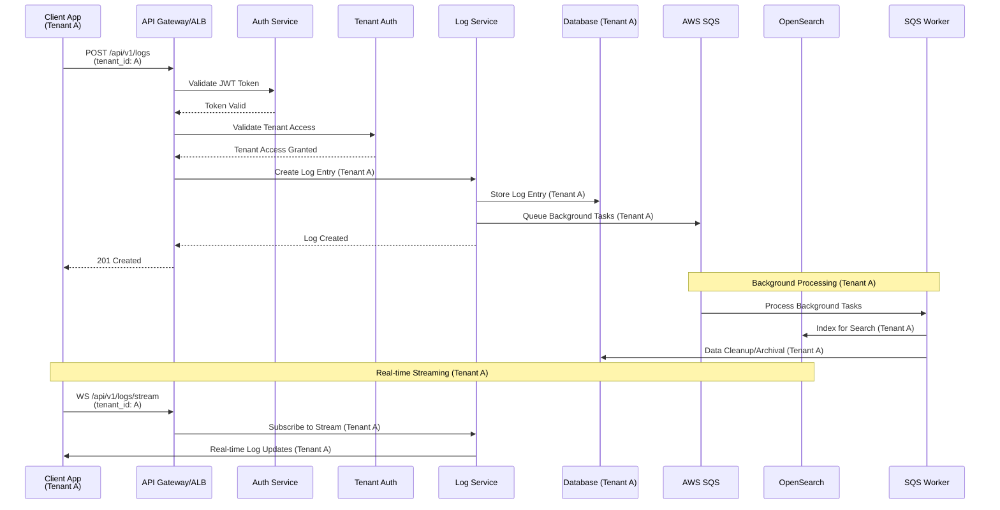

# Resola code challenge - Audit Log API

This is a code challenge project for creating an Audit Log API. The project uses [FastAPI](https://fastapi.tiangolo.com/) for framework structure

## Tech Stack
- **Framework:** FastAPI
- **API Gateway:** AWS API Gateway
- **Database:** PostgreSQL + TimeScaleDB
- **Message Queue:** AWS SQS
- **Search:** OpenSearch

## Features
- CRUD functions for audit logs (Create, Read, Update, Delete)
- Export feature for audit logs into .csv file
- Real time log streaming for audit logs
- Read and create tenants

## API Endpoints
```commandline
POST   /api/v1/logs                   # Create log entry (with tenant ID)
GET    /api/v1/logs                   # Search/filter logs (tenant-scoped)
GET    /api/v1/logs/{id}              # Get specific log entry (tenant-scoped)
GET    /api/v1/logs/export            # Export logs (tenant-scoped)
GET    /api/v1/logs/stats             # Get log statistics (tenant-scoped)
POST   /api/v1/logs/bulk              # Bulk log creation (with tenant ID)
DELETE /api/v1/logs/cleanup           # Cleanup old logs (tenant-scoped)
WS     /api/v1/logs/stream            # Real-time log streaming (tenant-scoped)
GET    /api/v1/tenants                # List accessible tenants (admin only)
POST   /api/v1/tenants                # Create new tenant (admin only)
```

## Architecture Diagram

### System Architecture (WIP)


### Audit Log Flow (TBD)


## Postman Collection (WIP)


## Project Structure
```
├── .aws/               # Amazon AWS credentials (access key, secret access key)
├── routers/            # Sub-routine files
│   ├── audit_logs.py   # API endpoints for audit_logs class 
│   └── tenants.py      # API endpoints for tenants class
├── venv/               # Virtual environment setup
├── .gitignore          # Git ignore rules
├── auth.py             # Authentication configuration
├── db.py               # Database connection
├── schemas.py          # Class declaration
├── test_main.py        # Test suite
└── README.md           # Project documentation
```

## Local Development Setup (WIP)

### Prerequsites (WIP)

### Install dependencies
```bash
pip install
```

### Initiate virtual environment
```bash
./venv/Scripts/activate
```

### Run local development server
```bash
uvicorn main:app --reload
```

## Learn More

- [FastAPI Documentation](https://fastapi.tiangolo.com/)
- [Postman Documentation](https://www.postman.com/product/what-is-postman/)